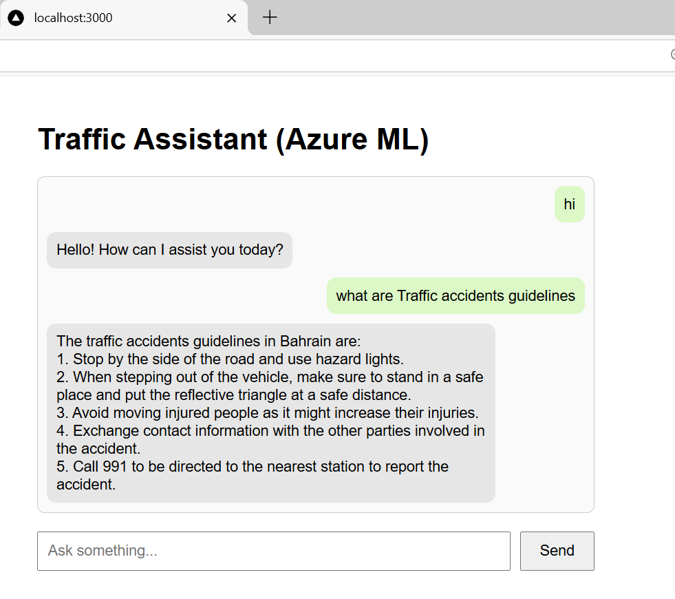
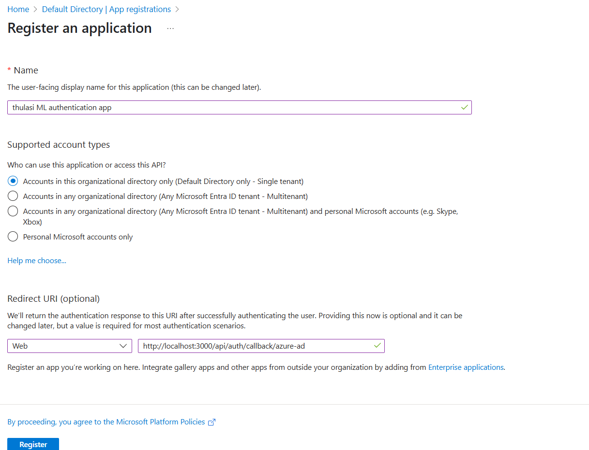

# 🤖📚 GPT-4 RAG Document-Aware Chatbot using Azure AI Studio, Next JS + EntraID SSO authentication 📄🔍☁️
 
## 🧠 Overview

This project implements a **Retrieval-Augmented Generation (RAG)** chatbot using **GPT-4** via **Azure AI**, where answers are strictly grounded in uploaded documents. It was designed for real-world use cases like **Country specific driving license guidance**, ensuring factual, document-based responses with no hallucinations.

---

## 📍 Use Case:  Driving Info Bot

### 👩‍💼 Agent Role:
An agent uploads official documents including:
- Driving Rulebook
- Vehicle Licensing Instructions
- Road Safety Guidelines

### 👨‍💻 User Role:
Citizens interact with a public-facing chatbot and ask questions like:

> “What’s the minimum age to apply for a private vehicle license in that specific country?”

### ✅ Expected Behavior:
- GPT-4 responds **only** from the uploaded documents
- If the question is out-of-context, it replies with:
  
  > “I am trained only on [country specific] driving license and road safety documents. Please ask something related to that.”

---

## 🧰 Tech Stack

| Layer             | Technology / Tool                          |
|------------------|--------------------------------------------|
| 🧠 Model          | AI GPT-4 via Azure AI Service      |
| 🧪 AI Platform    | Azure AI Studio                            |
| 📦 Vector Search  | Azure AI Search (Semantic + Vector Index)  |
| 💾 Storage        | Azure Storage Account (document upload)    |
| 🔐 Security       | Azure Key Vault, Entra ID (SSO)            |
| 🖥️ Compute        | Azure Serverless Compute (for model)       |
| 🌐 Frontend       | Next.js (React-based Web App)              |
| 📡 API & Auth     | Microsoft Graph API, Entra App Registration|

---

## 🧱 Architecture & Components

### 1. Azure AI Studio (Foundry)
- Unified platform for model building, deployment, and orchestration

### 2. AI Hub & Prompt Flow
- Document ingestion → chunking → embedding
- Indexed using **Azure Cognitive Search**

### 3. GPT-4 with RAG
- Retrieval-based approach: finds the top-k relevant chunks
- GPT-4 generates an answer strictly grounded in retrieved data

### 4. Prompt Flow Logic
- Python node to validate user input context
- Guardrails to reject unrelated questions
- Renders clean, formatted responses

### 5. Frontend (Next.js)
- Secure chat UI with Microsoft Entra SSO
- Hosted as a **serverless LLM endpoint**

---

## 🔐 Safety & Guardrails

- Response moderation for harmful content
- Token limit enforcement for concise replies
- Out-of-context filtering logic
- Azure Entra role-based access

---

## 🏁 Milestones

### 🏗️ Setup & Configuration
- ✅ Created **AI Hub** in Azure AI Studio.
- ✅ Configured **Storage Account** and **Key Vault**.
- ✅ Set up **Networking** with public access for testing (Private Endpoint recommended for prod).

### 📁 Document Ingestion
- ✅ Uploaded sample documents directly or via storage account.
- ✅ Configured **Azure AI Search** to index and chunk the documents using ML-based pipeline.

### 🤖 Model Deployment & Prompt Flow
- ✅ Deployed **GPT-4** model using **serverless compute**.
- ✅ Created **Prompt Flow** to connect indexed content and GPT-4.
- ✅ Applied **custom Python code** to control response token limits and parse output.

### 💬 Chatbot Integration
- ✅ Deployed endpoint as a **web API**.
- ✅ Built secure frontend using **Next.js**.
- ✅ Integrated **Entra ID (SSO)** for authenticated user access.

### ✅ Testing & Validation
- ✅ Compared manual index lookup vs model response.
- ✅ Validated RAG-based responses using real document queries.

### 🧹 Cleanup (for Cost Optimization)
- ✅ Deleted unused models, endpoints, AI services, and resources.

---

## 🚀 Features

- 🔐 Authenticated Chatbot using Microsoft Entra SSO
- 🧠 GPT-4-powered intelligent responses
- 📄 RAG-powered (Retrieval-Augmented Generation) context handling
- 🗃️ Semantic + Vector Search via Azure AI Search
- 📦 Modular Prompt Flow with token management
- 🌍 Secure deployment via Next.js frontend

---

## ✅ Outcome

- Answers strictly grounded in uploaded documents
- Zero hallucination
- Government and compliance-ready chatbot
- Public facing with secure, verified responses
- Easily adaptable for other industries

---

## 💡 Future Expansion Ideas

- RTA / Passport / Visa Application Assistant
- University Handbook Helpdesk
- Employee Onboarding Assistant
- Product Documentation Assistant
- Legal & Contractual Support Bots

---

## 🧪 Cleanup After PoC

- Deleted temporary:
  - Entra apps
  - User identities
  - Blob storage
  - AI endpoints
- Ensured cost efficiency and no leftover billing

---

## 🧼 Destruction Plan

To avoid incurring charges:
- ❌ Delete AI model deployments
- ❌ Delete AI Studio resources (Hub, Project)
- ❌ Delete AI Search and Storage Account
- ❌ Delete Entra App Registrations
- ❌ Delete Resource Group

## 🧰 Tech Stack

| Tool | Description |
|------|-------------|
| 💡 GPT-4 | Via Azure AI, for natural language understanding |
| 🧠 Azure AI Studio | Used for Prompt Flow, AI Hub, RAG Orchestration |
| 📦 Azure Blob Storage | Stores ingested documents |
| 🔍 Azure Cognitive Search | Embedding & indexing for fast document retrieval |
| 🔐 Microsoft Entra ID | Auth for frontend access |
| 💬 Next.js | Frontend chat interface |
| ⚙️ Python | Logic in Prompt Flow to validate context & input |
| ☁️ Azure Serverless Endpoint | Final chatbot deployment |

---

## 🌐 **Azure**
**Azure** is Microsoft's cloud computing platform offering a wide array of services, including compute, storage, networking, AI, and DevOps tools, all managed through a global infrastructure. Azure enables businesses to build, deploy, and scale applications with reliability and security.

---

## 🧠 **Azure AI Service**
The **Azure AI Service** is a comprehensive suite of artificial intelligence tools provided by Azure. These services allow you to integrate AI capabilities into your applications without needing to build everything from scratch. Some key components include:
- **Azure AI Service** (providing access to models like GPT-3, GPT-4, DALL·E, and Codex)
- **Azure AI Vision**, **Speech**, and **Language** services for image recognition, speech-to-text, and language understanding.

---

## 🧪 **Azure AI Studio (Azure Foundry)**
**Azure AI Studio**, also known as **Azure Foundry**, is a unified platform designed for no-code and low-code development of AI solutions. It provides tools for building, training, and deploying AI models with minimal manual coding. Key features include:
- **Document ingestion**: Uploading and processing documents for training AI models.
- **AI Search and Indexing**: Configuration of search and indexing services for custom data.
- **Prompt Flow**: A visual interface for orchestrating AI workflows using prompts, models, and APIs.
- **RAG (Retrieval-Augmented Generation)**: A method of enriching AI responses by fetching context from external sources.

---

## 🏗️ **Foundry Hub & Project**
- **Hub**: A **centralized workspace** for organizing and managing multiple AI projects. It provides access to shared resources like datasets, compute, and security configurations.
- **Project**: An individual unit within the hub, where specific AI tasks are executed. Projects consist of:
  - Document uploads
  - Model deployments
  - AI search and indexing
  - Prompt flows for creating customized AI applications (e.g., chatbots).

---

## 🔌 **Model Endpoint vs Service Endpoint**
- **Model Endpoint**: A **REST API endpoint** that exposes a specific AI model (e.g., GPT-4, DALL·E) for interaction. It is project-specific and used to call models deployed in a particular **project**.
- **Service Endpoint**: A general **global endpoint** used to access various AI models and services across projects in Azure. This is used for connecting to AI resources like **AI** or **Azure AI** services.

---

## 🖥️ **Compute Instance vs Serverless Deployment**
- **Compute Instance**: A **virtual machine (VM)** used to host and run AI models. It requires manual management and incurs costs even when the instance is idle.
- **Serverless Deployment**: A deployment model where Azure automatically manages the infrastructure. You are billed based on usage, and no infrastructure management is required. It is highly scalable and cost-efficient for **production** environments.

---

## 🧠 **LLM (Large Language Models)**
**LLMs** are deep learning models trained on vast amounts of data to process and generate natural language text. **GPT-4** is an example of an LLM, capable of:
- Text generation
- Text summarization
- Code generation
- Question answering
- Chat completions  
These models are used for building intelligent assistants, chatbots, and other AI applications requiring deep language understanding.

---

## 🔁 **RAG (Retrieval-Augmented Generation)**
**RAG** is a hybrid approach combining retrieval and generation:
1. **Retrieve**: Relevant content from documents, databases, or external sources using semantic search techniques.
2. **Augment**: Enhance the model's prompt with the retrieved information.
3. **Generate**: Produce a final, more accurate, and grounded response using a Large Language Model (LLM) like GPT-4.  
RAG ensures that generated content is more accurate and contextually relevant, minimizing hallucinations.

---

## 🔄 **Prompt Flow**
**Prompt Flow** is a visual and code-based tool in **Azure AI Studio** used to orchestrate multi-step AI workflows. It allows users to:
- Chain together document retrieval, model inference, and output generation.
- Customize workflows using **Python**, **LLMs**, and external API calls.
- Build advanced AI applications such as intelligent chatbots or document-based search engines.
  

# Understandings

Azure AI studio - Unified platform to develop, develop and to manage AI solutions

 - tools from different vendors which we can use to create workflows to help in creating Intelligent applications

 Architecture
  1. AI Hub - Centralized resource ( shared resource ) - connections to dataset, compute resources & security. resources can be shared among underlying projects

  2. AI project - single entity part of HUB. 

  3. AI services - connect the different AI services ( like speech, language translator, vision + document, content safety )

  # Implementation 

  Create the Azure AI foundry resource

  

  first resource to create - HUB

  

  next is to setup storage account and keyvault to store the keys

  

  networking  -inbound access

  Setting it to public ( for testing)

  In production, a dedicated private endpoint controlled by vnet and subnet is expected

  

  

  

AI hub view in foundry

Model Catalog

tools from different vendors

like below 

vendors like

 - AI
 - microsoft
 - meta
 - nvdia...

Industry
 - manufacturing
 - mobility
 - consumer
 -  financial

Inference tasks ( purpose )
 - text-to-text
 - text classification
 - translation
 - chat completion ( chatgpt....google gemini...)

deployment options
 - Managed Instance ( we are to provision and manage the vm to deploy and run theese models)
 - serverless - Infra is managed by microsoft. Based on the hit / consumption charge is applied

 

 how to choose the appropriate model - > ? model benchmarks

 - to analyse which model to use
 - based on accuracy
 - based on model coherence ( based on the output trueness )
 - based on the groundness ( verification )
 - fluency
 - relevance
 - similarity
 
 gpt 40 - may have high accurancy

 Prompt catalog

- prompt is important for chat completion
- to set boundaries
- how the bot should work

- for sample, hiking recommendation

- tested with sample prompts from microsoft / vendors
- instruct how a bot should welcome the user, ask for information from user

Playground 

like a chatgpt interface
 - create a deployment ( based on the specific model and chat)
 - give the model instruction / system message / prompt catalog

 types of playground
 - assistance
 - speech
 - realtime transcription
 - batch transcription
 - image
 - audio
 - healthcare
 - language

Deployments
 - to deploy different model
  - can be used in hub / different projects

connection
 - to connect to open AI
 - to azure AI service
 - to storage account

Compute instances
- where our models will be deployed
- compute / serverless instances

Users
 
Content filters
 - for safety
 - filter - violence, hate, sexual, self-harm 
 - based on text / image
 - set the threshold

 # test by creating a project

 

 

# deploy a chat-completion model 

Base model

to go with serverless

try in playground

After updating the prompt catalog / system message - it is not responding with inappropriate context

you can deploy this application as a web app with gpt model and with custom system message

Prompt flow

- standard flow - Harness the power of Large Language Models, customized Python code, and more to craft your tailored prompt flow. Test the flow using custom datasets and seamlessly deploy as an endpoint for easy integration.

document will be uploaded to a storage account

use AI search and indexing service ( to index all the document) and break it into chuncks

this is how AI service consume the data for training

apply the python filtering on the output - to not to utilize

Use LLM - gpt model to produce the result

Using the Prompt flow to build 
GPT model for LLM
RAG - retrieval augmented generation ( where we train the LLM with our custom data )
deploy it to an endpoint and serve as a webapp

Implementation:

cleanup the sample LLM and python snippet for output

start the compute session

check the serverless compute instance status in HUB

Add your data ( pdf ) either to a storage account or directly from the local storage

this documents will be used to train our LLM

Data has been uploaded

setup AI search service - to index

data from our AI studio

Create a new resource to use AI search service

Job is inprogres

- Machine learning service which creates the chunck, updates the ACS index, register the vector index

check the indexes in Azure search service

    

    lets search something from our pdf manually in the index

    

    good that is caught

    

add the `index lookup` tool 

setup in such a way the input is from the query

lets test the query

compare the manual vs model results

lets make our custom LLM

control the user input and output so not to exceed our token limit

using python custom code

importing json package, convert the output to json and only allow the text field as response

run to test

check the output

now we cannot provide users this prompt flow to access

hence we can deploy this an application endpoint

the model deployment on the endpoint is in progres

now, how to consume this ?

setup a next js application 

.env.local and not version it in repo #

setup Entra SSO

https://microsoft.github.io/MicrosoftCloud/tutorials/docs/Authentication-App-With-NextJs-And-Microsoft-Graph/Configuring-Application-Azure-Active-Directory

install node next js packages for SSO redirection using microsoft graph

setting up the protected route

only allowed users can login 

AND ACCESS OUR chatbot

# destruction

Delete the entra app registration and testadmin user
Delete the model deployment endpoint
delete the deployed models
delete the AI service endpoints

delete the project & Hub
delete the AI search & service resource
delete the storage account, keyvault
delete the resource group

